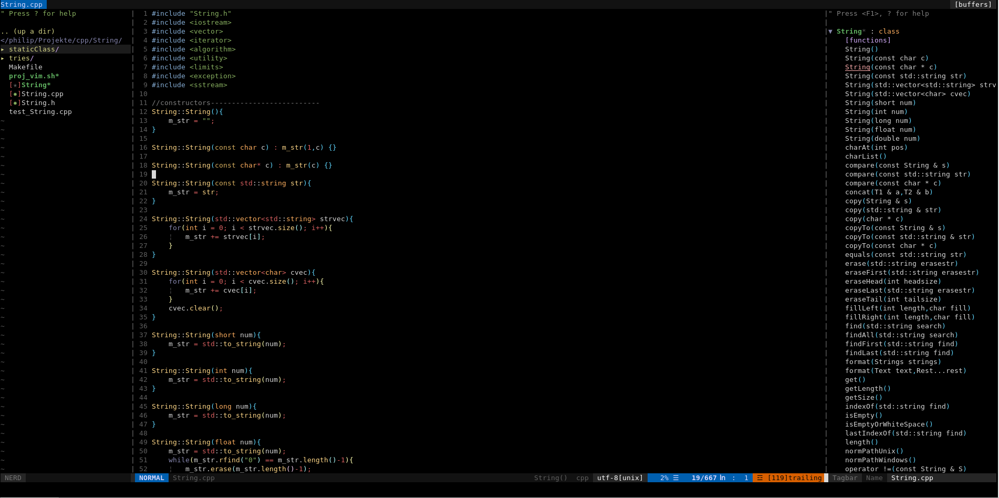

# vim-plugin-collection
This collection several useful tools to make your programming with vim easier.
It is in a very early phase, so the installation or plugin-compatiblities could be buggy

## Table of Contents
1. [Major Features](#major_features)  
2. [Minor Features](#minor_features)
3. [Third Party Requirements](#third_party) 
4. [Compileable Plugins](#compile) 
5. [Working Autocompletion](#auto)
6. [Upcoming Autocompletion](#upcomingauto) 
7. [Knowing Issues](#issues) 
8. [Examples](#examples) 
9. [FAQ](#faq) 
10. [Project Future](#future)

## Major Features  

* [vim-plug](https://github.com/junegunn/vim-plug) to add plugins in a easy way 
* [vim-airline](https://github.com/vim-airline/vim-airline) for a modern user interface (+ [themes](https://github.com/vim-airline/vim-airline-themes))
* Multi language autocompletion with help of [completor](https://github.com/maralla/completor.vim) and [mucomplete](https://github.com/lifepillar/vim-mucomplete) (see below for which languages are supported)
* [NERDTree](https://github.com/scrooloose/nerdtree) and [NERDTree-Tabs](https://github.com/jistr/vim-nerdtree-tabs) to have a integrated file manager 
* [Tagbar](https://github.com/majutsushi/tagbar) to show your functions, classes and variables in a list and jump to them fast  
* [Syntastic](https://github.com/vim-syntastic/syntastic) to for showing syntax errors during programming
* [SingleCompile](https://github.com/vim-scripts/SingleCompile) to run fast test compilings without closing vim
* [UtilSnips](https://github.com/SirVer/ultisnips) and [vim-snippets](https://github.com/honza/vim-snippets) support for many languages 
* Advanced syntax highlighting for [C++](https://github.com/octol/vim-cpp-enhanced-highlight), [PGSQL](https://github.com/lifepillar/pgsql.vim) and [HTML5](https://github.com/othree/html5.vim) 
* Settingloader in ./autoload to prefend a to big .vimrc and plugin incompatibilities  

## Minor Features  

* [jellybeans](https://github.com/nanotech/jellybeans.vim)
* [rainbow bracklets](https://github.com/luochen1990/rainbow) to highlight brackets 
* [identLine](https://github.com/Yggdroot/indentLine) (Highlights line indentation) 
* [auto-pair](https://github.com/jiangmiao/auto-pairs) to autoclose brackets and quotation marks
* [Commentary](https://github.com/tpope/vim-commentary.git) faster comment out lines
* [VimWiki](https://github.com/vimwiki/vimwiki) (A wiki system for vim) 
* [DidYouMean](https://github.com/EinfachToll/DidYouMean) asks for the right file to open when similiar files exists
* Smart hotkeys (using same hotkey to toggle on or of a feature) 
* Small Syntax Highlights by myself

## Third Party Requirements:  

* __Clang__ for C-Familiy autocompletion
* __Jedi__ for Python autocompletion
* __npm, nodejs__ for (good) JavaScript autocompletion, default needs nothings
* __maven__ to build Java autocompletion at your own
* [__phpctags__](https://github.com/vim-php/phpctags) for better PHP autocompletion experience

### Installing third party Requirements:

#### Clang, npm, nodejs, lua, maven:
* Debian/Ubuntu: `sudo apt-get install clang nodejs python3 npm lua5.3 liblua5.3 maven`, for jedi: `sudo pip3 install`
* Arch Linux: `sudo pacman -S clang nodejs python npm lua maven`, for jedi: `sudo pip3 install`

The named OS above are tested

## Plugins you need compile at your own:  

After execution of the install.sh script you can use the 
other install scripts for plugins that you need to build. 
* omnisharp__install.sh for C# autocompletion 
* java_install.sh for Java
* javascript_install.sh for Javascript

## Working autocompletion:  

* C/C++ (Completor+clang) 
* Java (JavaComplete2)
* HTML5 (MuComplete)
* CSS (MuComplete)
* PHP (Completor+phpctags)
* JavaScript (Competor+tern)
* Lua (Lua ftp plugin)
* C# (MuComplete+OmniSharp-vim) 
* Python (Completor+Jedi)

## Upcoming autocompleton:  

* Rust (Completor+racer)

## Knowing issuses:  
### C# omnicompletion does not work:
If C# completion does not work after executing the omnisharp_install script 
you have to add a empty .sln (Visual Studio Solution) file to your C# projecti or working folder. 
I don't know why but then is works. 

## Examples (ttyrecord) coming soon:  

### C/C++

### Java

### Lua

### HTML

### CSS

### PHP

### JavaScript

## FAQ:  

Why I use different autocompletion plugins?
* I have tested several plugins and each has pros and cons.
  * µComplete is very good for most filetypes (e.g html,css), but it needs extra plugins for using C/C++ autocompletion and it was very slow. It also is very compatible with vim ommicompletions. The harmony between mucomplete and the OmniSharp-Server is also great.
  * Completor on the other hand is very good for C/C++ (much faster than µComplete with clang-complete), PHP, Pyhton (Jedi) and Javascript

Why I don't use YouCompleteMe?
* YCM is a good solution if you are lazy to configurate vim like my vim-plugin-collection and on the other hand it works very well, but:
* I and others users has sometimes build problems with YCM
* The omnicomplete server ycmd can also make problems if it crashes (no autocompletion then) 
* Basic install is much bigger then vim-plugin-collection (and it is only autocompletion) 
    * I don't want to blow out the collection to hundrets of megabyte 
* C# completion is not as smart then my solution 
* Web programming is not supported

## The future of the vim-plugin-collection:  
The VPC is a all in one solution but some people need only a part of it.
When I have more time I will make a series of VIM-IDEs for webprogramming,
compiler based programming and script based programming. 
I will also rename the VPC to a name that fits better to a all in one IDE.
