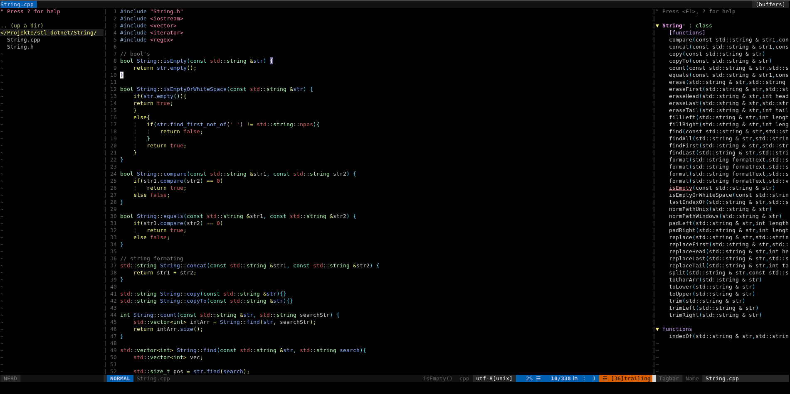
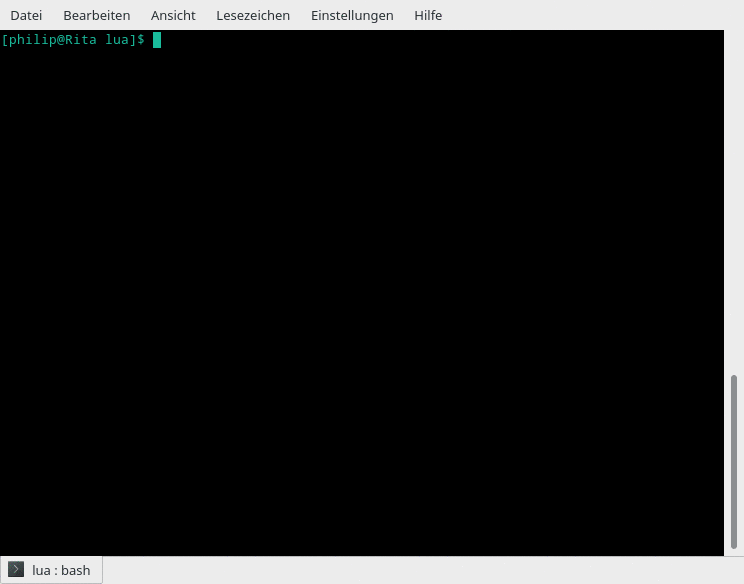
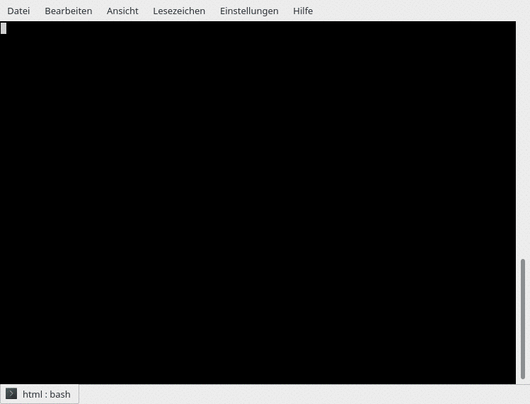

------

-------------------------------------------------------------------------------------------------------------

!Warning: This project is under active development!
----
1. [Introduction](#introduction) 
2. [Features](#features)
    1. [Major Features](#majorfeatures)  
    2. [Minor Features](#minorfeatures)
    3. [Working Autocompletion](#auto)
    4. [Upcoming Autocompletion](#upcomingauto) 
3. [Installation](#installation) 
    1. [Requirements](#requirements)  
    2. [Compileable Plugins](#compile) 
4. [Syntax Checkers](#syntaxcheckers)
5. [Debugger](#debugger) 
6. [Knowing issues](#issues) 
7. [Examples](#examples) 
8. [FAQ](#faq) 
9. [Project future](#future)
-----------------------------------------

## 1\. Introduction
TheVimIDE has the target to be a fully functional integrated development enviroment for the [Vim](www.vim.org) and [NeoVim](https://neovim.io/) editors. 
The offspring of TheVimIDE was a small plugin collection to make my daily work with Vim more comfortable. Over time and other IDEs as inspirations I 
had the idea to make Vim step by step to an IDE with all the features like autocompletion, syntax checking and many other features that makes programming
easier and faster. 

TheVimIDE has five major targets: 
* Combine fastness of a texteditor with comfort of IDE features
* Support as many popular languages as possible
* To be easy to configure
* To be fully functional out of the box 
* To be expandable and forkable 

 

## 2\. Features 
Below you can the the most considerable features.

 

### 2.1\. Major Features

* [vim-plug](https://github.com/junegunn/vim-plug) to add plugins in a easy way 
* [vim-airline](https://github.com/vim-airline/vim-airline) for a modern user interface (+ [themes](https://github.com/vim-airline/vim-airline-themes))
* Multi language autocompletion with help of [completor](https://github.com/maralla/completor.vim) and [mucomplete](https://github.com/lifepillar/vim-mucomplete) (see below for which languages are supported)
* [NERDTree](https://github.com/scrooloose/nerdtree) and [NERDTree-Tabs](https://github.com/jistr/vim-nerdtree-tabs) to have a integrated file manager 
* [Tagbar](https://github.com/majutsushi/tagbar) to show your functions, classes and variables in a list and jump to them fast  
* [Syntastic](https://github.com/vim-syntastic/syntastic) to for showing syntax errors during programming
* [SingleCompile](https://github.com/vim-scripts/SingleCompile) to run fast test compilings without closing vim
* [UtilSnips](https://github.com/SirVer/ultisnips) and [vim-snippets](https://github.com/honza/vim-snippets) support for many languages 
* Advanced syntax highlighting for [C++](https://github.com/octol/vim-cpp-enhanced-highlight), [PGSQL](https://github.com/lifepillar/pgsql.vim), [HTML5](https://github.com/othree/html5.vim) and [CSS](https://github.com/ap/vim-css-color)
* Settingloader in ./autoload to prefend a to big .vimrc and plugin incompatibilities  

 

### 2.2\. Minor Features 

* [jellybeans](https://github.com/nanotech/jellybeans.vim) color scheme
* [rainbow bracklets](https://github.com/luochen1990/rainbow) to highlight brackets 
* [identLine](https://github.com/Yggdroot/indentLine) (Highlights line indentation) 
* [auto-pair](https://github.com/jiangmiao/auto-pairs) to autoclose brackets and quotation marks
* [closetag](https://github.com/alvan/vim-closetag) to autoclose (x)html/xml tags
* [Commentary](https://github.com/tpope/vim-commentary.git) faster comment out lines
* [VimWiki](https://github.com/vimwiki/vimwiki) (A wiki system for vim) 
* [vim-notes](https://github.com/xolox/vim-notes) (A notes system for vim)
* [DidYouMean](https://github.com/EinfachToll/DidYouMean) asks for the right file to open when similiar files exists
* [Search Tasks](https://github.com/gilsondev/searchtasks.vim) for searching TODO, FIXME or other tags in your project 
* [Bookmarks](https://github.com/MattesGroeger/vim-bookmarks) to toggle and go through bookmarks in your file/project
* Smart hotkeys (using same hotkey to toggle on or of a feature) 
* Small Syntax Highlights by myself

 

### 2.3\. Working autocompletion

* C/C++ (Completor+clang) 
* [Java](https://github.com/artur-shaik/vim-javacomplete2) (JavaComplete2)
* HTML5 (MuComplete)
* CSS (MuComplete)
* [PHP](https://github.com/shawncplus/phpcomplete.vim) (Completor+phpctags)
* [JavaScript](https://github.com/ternjs/tern_for_vim) (Competor+tern)
* [Lua](https://github.com/xolox/vim-lua-ftplugin) (Lua ftp plugin)
* [C#](https://github.com/OmniSharp/omnisharp-vim) (MuComplete+OmniSharp-vim) 
* Python (Completor+Jedi)

 

### 2.4\. Upcoming autocompleton: 

* Rust (Completor+racer)

 

## 3\. Installation
All you need to do is to run the ./install.sh for Vim or ./install-neovim.sh for NeoVim. 
You will be asked if you want to build/install a view features to get the whole functionality. 

 

### 3.1\. Requirements
First of all make sure that your Vim / Neovim editor is compiled with python2 and python3 support. 
* For Arch Linux (and derivates) Vim is by default compiled with python support. 
* For Ubuntu/Debian install vim-nox

Upgrade Neovim (all Linux plattforms): 
* sudo pip2 install --upgrade neovim
* sudo pip3 install --upgrade neovim

You need to install these third party programs for the mentioned features: 
* __Clang__ for C-Familiy autocompletion
* __Jedi__ for Python autocompletion
* __npm, nodejs__ for (good) JavaScript autocompletion, default needs nothings
* __maven__ to build Java autocompletion at your own
* [__phpctags__](https://github.com/vim-php/phpctags) for better PHP autocompletion experience

#### Installing third party Requirements:
* Debian/Ubuntu: `sudo apt-get install clang nodejs python3 npm lua5.3 liblua5.3 maven`, for jedi: `sudo pip3 install jedi`
* Arch Linux: `sudo pacman -S clang nodejs python npm lua maven`, for jedi: `sudo pip3 install jedi`

The named OS above are tested

 

### Plugins you need compile at your own:

After execution of the install.sh script you can use the 
other install scripts in ./build for plugins that you need to build. 
* omnisharp__install.sh for C# autocompletion 
* java_install.sh for Java
* javascript_install.sh for Javascript

 

## 4\. Syntax Checkers
The default syntax checkers for following languages are:
* JavaScript: Jshint, install it with `sudo npm install -g jshint`
* Python: flake8, install it with `sudo pip install flake8` 

If you want to change the checker of a language:
Edit Settingloader#Syntastic() at ~/.vim/autoload/settingloader.vim 
Change: `let g:syntastic_yourlanguage_checkers = ['yourchecker']` 

 

## 5\. Debugger
Following debugger engines are installed by default: 
* ConqueGdb for C/C++ (gdb must be installed)
  * Call it with :ConqueGdb binaryfile -q 
* Vdbug, Debugger for Python, PHP, Ruby and Pearl (JavaScript is not working at this time)

For ConqueGdb I will write shorter command aliases.

Vdbug has a very good frontend but needs thrid party requirements for every single language. 
I will write serveral install scripts to make the installation of them very easy.
Until then you need to read the help under: :help VdbugSetUp 

 

## 6\. Knowing issuses
### C# omnicompletion does not work:
If C# completion does not work after executing the omnisharp_install script 
you have to add a empty .sln (Visual Studio Solution) file to your C# projecti or working folder. 
I don't know why but then it works. 

### C# Compiling error with magic number 542
This is a bug that occurs on gui-based terminals when ncurses 6.1 is installed. 
A hotfix for this bug is to run the build/omnisharp_install.sh with the xterm terminal. 

 

## 7\. Examples:

### C/C++

### Java

### Lua

### HTML

### CSS

### PHP

### JavaScript

 

## 8\. FAQ

Why I use different autocompletion plugins?
* I have tested several plugins and each has pros and cons.
  * µComplete is very good for most filetypes (e.g html,css), but it needs extra plugins for using C/C++ autocompletion and it was very slow. It also is very compatible with vim ommicompletions. The harmony between mucomplete and the OmniSharp-Server is also great.
  * Completor on the other hand is very good for C/C++ (much faster than µComplete with clang-complete), PHP, Pyhton (Jedi) and Javascript

Why I don't use YouCompleteMe?
* YCM is a good solution if you are lazy to configurate vim like my vim-plugin-collection and on the other hand it works very well, but:
* I and others users has sometimes build problems with YCM
* The omnicomplete server ycmd can also make problems if it crashes (no autocompletion then) 
* Basic install is much bigger then vim-plugin-collection (and it is only autocompletion) 
    * I don't want to blow out the collection to hundrets of megabyte 
* C# completion is not as smart then my solution 
* Web programming is not supported

 

## 9\. Project future
